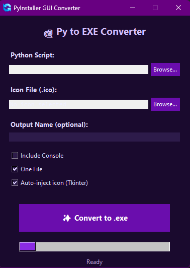

# Py to EXE Converter

A beautiful GUI tool to convert Python scripts to standalone `.exe` files with automatic icon handling and zero leftovers.

 

## Features
- Dark purple UI (380×500)
- Auto-injects icon for Tkinter apps
- Cleans up dist/, build/, .spec, and temp files
- Places .exe next to your .py

## How to Use
1. Run `py_to_exe_converter.py`
2. Select your `.py` and `.ico`
3. Click "Convert to .exe"
4. Done!

> Requires: `pip install pyinstaller`
